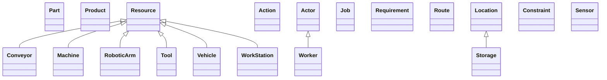

# API Reference

## Overview

The Open Manufacturing Model provides a comprehensive framework for modeling manufacturing operations. 
Below is an overview of the main components and their relationships.

### Class Architecture

The following diagram shows the main classes and their inheritance relationships:

### Key Components

The framework is organized into several main component groups:

**Resources**
* Part
* Product
* Resource

**Equipment**
* Conveyor
* Machine
* RoboticArm
* Tool
* WorkStation

**Actions**
* Action
* Actor

**Production**
* Job
* Requirement
* Route

**Logistics**
* Location
* Vehicle

**Other**
* Constraint
* Sensor
* Storage
* Worker

## Enumerations

These enumerations define the valid values for various attributes in the system.

- [ActionStatus](./actionstatus.md)
- [ActionType](./actiontype.md)
- [JobPriority](./jobpriority.md)
- [JobStatus](./jobstatus.md)
- [LocationType](./locationtype.md)
- [PartType](./parttype.md)
- [ProductionState](./productionstate.md)
- [RequirementType](./requirementtype.md)
- [ResourceStatus](./resourcestatus.md)
- [ResourceType](./resourcetype.md)
- [StorageType](./storagetype.md)
- [VehicleType](./vehicletype.md)

## Classes

These classes form the core components of the Open Manufacturing Model.

- [Action](./action.md)
- [Actor](./actor.md)
- [Constraint](./constraint.md)
- [Conveyor](./conveyor.md)
- [Job](./job.md)
- [Location](./location.md)
- [Machine](./machine.md)
- [Part](./part.md)
- [Product](./product.md)
- [Requirement](./requirement.md)
- [Resource](./resource.md)
- [RoboticArm](./roboticarm.md)
- [Route](./route.md)
- [Sensor](./sensor.md)
- [Storage](./storage.md)
- [Tool](./tool.md)
- [Vehicle](./vehicle.md)
- [WorkStation](./workstation.md)
- [Worker](./worker.md)